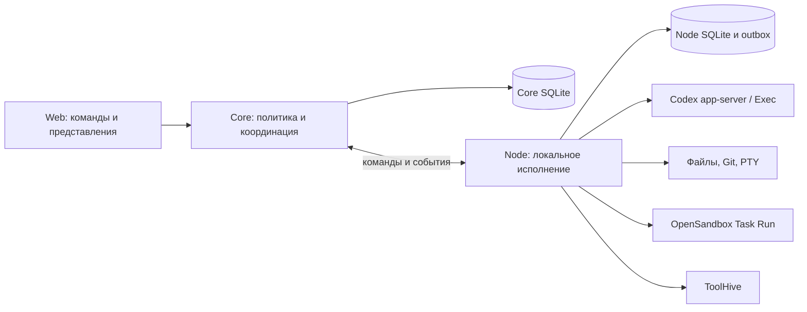
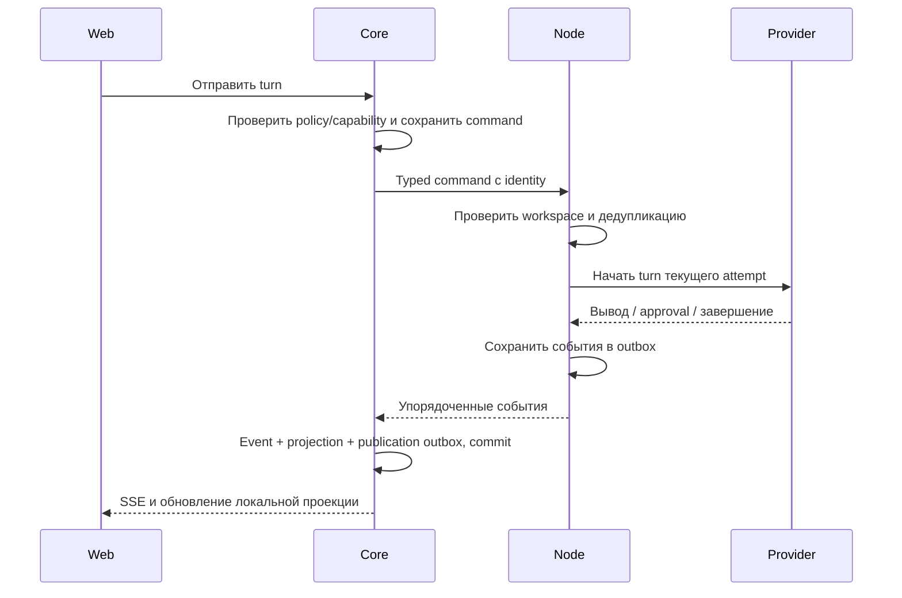

# Архитектура и выполнение агентов

Снимок: `0.2.26`, commit `9d096834eadfacd9f04a551c5557b33194e7ca4b`,
ретроспектива от 2026-10-03. Этот документ описывает конечное состояние
итерации. Намерения из ранних разделов архитектуры не считаются реализованными
без подтверждения кодом. Общие основания: [архитектура](../../../systems/architecture.md)
и [журнал релизов](../../../releases.md).

## Владение состоянием

Главный сохраняемый принцип — один управляющий Core и исполняющие Node.
Браузер обращается к Core; доступ к workspace и процессам остаётся на Node.
Эта граница позволяет закрыть браузер, сохранив историю и выполнение, и не
требует отдельного подключения клиента к каждой машине.

| Граница | Авторитетное состояние | Чего она не заменяет |
| --- | --- | --- |
| Core | Projects, placements, sessions, commands, события и проекции, policy, Tool/Plugin Registry | Проверку фактического локального окружения |
| Node | Workspace, процессы, PTY, runtime descriptors, command deduplication, локальный outbox | Глобальную идентичность и разрешения Core |
| Web | Выбор пользователя, локальная проекция и состояние интерфейса | Durable историю и подтверждение результата исполнения |
| Provider | Native thread, turn и provider interactions | Политику, маршрутизацию и журнал Uprava |

`Project` обозначает логический проект; `ProjectPlacement` — уникальную пару
Node и канонического пути. `Workspace` — пользовательское представление
placement, а не ещё один идентификатор. Одинаковый путь на двух Node сам по
себе не объединяет проекты. См. [контракт размещения](../../../systems/areas/003-distributed-runtime-coordination.md).

## Сквозной путь команды

Сильная сторона реализации — публикация после durable commit. В Node
результат команды сохраняется до отправки; Core связывает событие, проекцию и
публикацию транзакцией. Повтор доставки не должен создавать второй результат.
`seq` упорядочивает поток runtime, а `session_projection_seq` позволяет
возобновлять объединённый поток сессии. Sequence gap становится наблюдаемым
degraded state; восстановление использует snapshot/replay.

Подтверждение реализацией: [Core session orchestration](../../../../crates/uprava-server/src/runtime/application/session.rs),
[event persistence](../../../../crates/uprava-server/src/persistence/event.rs),
[Node execution](../../../../crates/uprava-node/src/runtime/application/execution.rs).
Это даёт основу восстановления, но не является измерением задержек интерфейса.

## Контракты работы

| Контракт на финальном baseline | Поведение | Цена и граница |
| --- | --- | --- |
| Managed Agent | Node владеет Codex app-server на время attempt; один native thread принимает несколько turn, approvals и input | Нужны supervisor, policy hash, pending interactions, reconciliation и teardown |
| Exec compatibility | Отдельные запуски `codex exec/resume`, сохранение transcript/resume reference | Explicit unsafe profile; не эквивалент интерактивного app-server |
| Background Job | Core хранит расписание и claims; запуск получает отдельную session с explicit Exec profile | Это не бессмертный агент; sessionless sandboxed Job остаётся follow-up |
| Task Run | Отдельный bounded контракт: worktree, OpenSandbox, результат и evidence | Не создаёт интерактивную Agent session; credential acceptance отложена |

Начальный persistent runtime означал долговечную управляемую сессию, но не
обязательно живой процесс между turn. [Релизы `0.2.20–0.2.26`](../../../releases.md)
последовательно добавили protocol gate, shared policy, Node supervisor, Core
orchestration, UI и hardening. Поэтому вывод «реактивного runtime нет» неверен
для финального снимка.

В [Managed supervisor](../../../../crates/uprava-node/src/runtime/managed_provider.rs)
реально используются `thread/start`, `thread/resume`, `turn/interrupt` и
loopback WebSocket. Создание без profile выбирает Managed и отказывает при
отсутствующей capability; тихого перехода в Exec нет. Существующие сессии
сохраняют profile. Политика неизменна внутри session.

## Управление и восстановление

**Detach/attach:** меняется подключение пользователя, живой provider не
останавливается. **Interrupt:** завершает текущий turn; priority dispatch не
ожидает основной execution lock, а timeout приводит к escalation.
**Stop/resume:** закрывает attempt, затем возобновляет native thread новым
attempt. **Node restart:** сохранённый PID не считается доказательством живого
процесса. **Idle expiry:** требует фактического Stop, отзыва MCP lease и
завершения pending interactions. Матрица поведения есть в
[runbook](../../../runbooks/managed-agent-runtime.md).

Существующие тесты проверяют отдельные контракты:

- [Core control](../../../../crates/uprava-server/src/runtime/tests/control.rs):
  current attempt, newest connection generation, cross-node rejection и outbox retry;
- [Core events](../../../../crates/uprava-server/src/runtime/tests/event.rs):
  идемпотентность, gap, rollback промежуточных стадий транзакции;
- [Core runtime](../../../../crates/uprava-server/src/runtime/tests/runtime.rs):
  expiry, late input, stop перед новым attempt;
- [Node managed fake-provider](../../../../crates/uprava-node/src/runtime/managed_provider.rs):
  два turn одного thread, interactions, lease rotation, interrupt и unknown callback;
- [Node reliability](../../../../crates/uprava-node/src/runtime/tests/reliability.rs):
  сохранение до отправки, bounded queue и priority execution.

Это найденное тестовое покрытие, а не заявление о новом live acceptance.
Результаты проверки пакета фиксируются в [его паспорте](../README.md).

## Урок для следующей итерации

**Опыт пользователя:** к концу разработки широким продуктом было неудобно
пользоваться; живой чат следовало качественно довести раньше. **Наблюдение по
реализации:** нужные runtime-механизмы появились, но после многих независимых
срезов. **Вывод:** наличие lifecycle и тестов не подтверждает удобство полного
сценария. **Гипотеза для проверки:** меньший первый scope позволит раньше
отладить задержки, reconnect, approvals и ясность состояния.

Сохранить стоит authority boundaries, типизированные команды, durable события
и разделение Agent/Task/Job. Переносить всю сложность следует только при
потребности первого сценария. Отдельно измерять реакцию интерфейса, доставку
событий, подтверждение interrupt и задержку провайдера; смена SSE на WebSocket
сама по себе не доказывает улучшение этих показателей.
