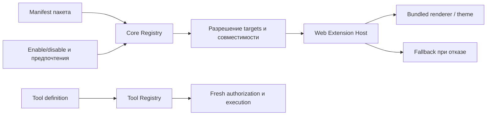

# Решения, компромиссы и модульность

Снимок: `0.2.26`, commit `9d096834eadfacd9f04a551c5557b33194e7ca4b`,
2026-10-03. Основания — [архитектура](../../../systems/architecture.md),
[модель work surface](../../../systems/areas/004-modular-ui-work-surface.md)
и выборочное чтение реализации. Альтернативы ниже — ретроспективное сравнение;
оно не означает, что каждая альтернатива исторически прототипировалась.

## Решения, которые стоит сохранить вместе с причинами

| Контекст и решение | Результат в реализации | Компромисс и альтернатива |
| --- | --- | --- |
| Удалённые Node: Core является единой управляющей точкой | Общие identity, policy, routing, история и реестры | Добавляет сеть и синхронизацию; прямое подключение клиента к Node проще локально, но размножает authority |
| Надёжное восстановление: typed commands/events и durable outbox | Можно различать intent, исполнение и наблюдаемое состояние | Больше схем и state machines; простой RPC оставляет неоднозначность после разрыва связи |
| Разные workloads: Agent, Task и Job имеют разные execution contracts | Managed не навязывает интерактивность фоновым запускам | Больше явных моделей; один универсальный runtime скрывал бы разные гарантии |
| Поиск инструментов: Search → Inspect → Execute | Полная schema раскрывается по необходимости, Execute повторно проверяет доступ | Дополнительный шаг и routing; полный catalog проще для малого числа tools |
| Расширение продукта: Tool Registry отделён от Plugin Registry | Интеграция с tools не получает автоматически право менять интерфейс | Два связанных lifecycle; единый registry смешивал бы callable capability и пакет расширения |
| Проверяемые результаты: типизированные refs, trace и artifacts | UI может связать вывод, команду, diff и проверку | Требует устойчивых ссылок и fallback; свободный текст дешевле, но хуже проверяется |

**Опыт пользователя:** tracing и централизованное управление инструментами
полезны по замыслу. **Граница вывода:** это поддержка направления, а не
подтверждение повседневной полезности каждой реализации. MCP/ToolHive не
получили достаточной пользовательской апробации.

Для trace важно сохранять связь с наблюдаемыми событиями. Объяснение,
сгенерированное агентом после работы, не равно достоверной записи внутренних
причин решения. Текущая [проекция evidence/trace](../../../../crates/uprava-server/src/runtime/application/projection.rs)
и refs ценны прежде всего как способ перейти к исходному результату, команде
или событию. В следующем продукте такой переход стоит проверить на реальном
review, прежде чем расширять количество представлений.

## Что означает модульность текущего baseline

Есть две независимые оси: организация кода и расширение работающего продукта.
Внутренняя организация Core/Node уже разделяет transport, application,
persistence и локальное исполнение; [architecture gate](../../../../scripts/check_runtime_boundaries.py)
следит за зависимостями и composition roots. Это облегчает локальные изменения,
но само по себе не создаёт пользовательскую систему расширений.

В продуктовой модели Core хранит package, installation, desired state,
совместимость и effective contributions. Web монтирует доступные contributions
в известные поверхности. [Plugin Registry implementation](../../../../crates/uprava-server/src/runtime/application/plugins.rs)
и [Web Extension Host](../../../../apps/web/src/plugins/ExtensionHost.tsx)
подтверждают этот путь.

Существенная граница: текущий Extension Host содержит явную карту bundled
implementation IDs и lazy imports. Это управляемая модель собственных
расширений, а не доказанная экосистема произвольных сторонних пакетов.
Архитектурный перечень `workbench.command`, tabs, menu actions, Inspector и
reference handlers шире проверенного здесь пути тем и renderers. Наличие
пункта в проектном документе не считается готовым публичным API.

## Композиция и изоляция

[Contribution resolution](../../../systems/areas/012-plugin-contribution-resolution.md)
разрешает совпадения по target, а не случайному порядку загрузки. Есть
`exclusive` и `ordered` режимы, revisioned preferences, отключение кандидата и
видимые конфликты. Пример — цепочка Markdown/Plain Text с fallback.

Плюс подхода: отключение расширения и конфликт становятся управляемыми
состояниями. Цена: пользователь и автор plugin должны понимать targets,
приоритеты, совместимость и причины неактивности. **Гипотеза:** для узкого чата
этот механизм можно вводить постепенно, сохраняя контракт fallback, но не
показывая все настройки прежде появления реального выбора.

Generated React opt-in расширяет выразительность через отдельный builder и
sandboxed iframe. Он не получает доступ к главному React tree; actions идут
через Core. Такое разделение полезно сохранить как принцип доверия, однако
интеграционный и эксплуатационный вес нужно оценивать отдельно от красоты
демонстрационного результата.

Существующие [Core plugin tests](../../../../crates/uprava-server/src/runtime/tests/plugins.rs)
проверяют повторный bootstrap, сохранение desired state при upgrade/restart,
enable/disable, конфликты, порядок и отклонение stale revision.
[Web resolution tests](../../../../apps/web/src/plugins/contribution-resolution.test.ts)
фиксируют выбор renderers; [dynamic UI tests](../../../../crates/uprava-server/src/runtime/tests/dynamic_ui.rs)
проверяют opt-in, отказ небезопасного source, fallback и idempotent actions.
Это наличие регрессий в репозитории; новая ручная проверка стороннего plugin
при подготовке этого текста не выполнялась.

## Переосмысление до композиции уровня Vim

**Требование пользователя:** модульность нужно переосмыслить, ориентируясь на
уровень Vim. Оно согласуется с уже записанной идеей «действие + адресуемый
объект», но не требует копирования интерфейса или модели доверия редактора.

Предлагаемые свойства для исследования и прототипа:

1. **Адресуемые объекты:** session, message, selection, artifact, diff hunk;
   стабильная ссылка и доступный контекст действия.
2. **Композиция команд:** одна команда вызывается из клавиатуры, palette,
   контекстного меню и разрешённого agent tool без отдельной бизнес-логики.
3. **События и hooks:** расширение подписывается на явный контракт с границами
   времени, объёма данных и прав.
4. **Заменяемые представления:** отказ или отключение renderer сохраняет
   данные, доступ к исходнику и основной чат.
5. **Небольшой устойчивый API:** версионирование, diagnostics, отзыв разрешений
   и lifecycle проверяются до роста catalog.

Это **кандидаты следующей итерации**, не реализованные свойства текущего
baseline. Первый эксперимент — добавить одну команду над выбранным объектом
и одно представление через публичный контракт, затем отключить расширение и
проверить восстановление. Такой опыт покажет, какие primitives действительно
нужны ядру. Подробности сравнения референсов — в
[исследовании модульности](../research/04-modularity.md).

Главный процессный урок: правило plugin-first полезно, когда расширение
проверяет небольшой общий контракт. Оно становится дополнительным scope,
если каждая новая фича одновременно требует новой платформенной подсистемы.
Сохранить все идеи можно в каталоге, а перенос реализации выбирать по
готовности первого пользовательского сценария.
